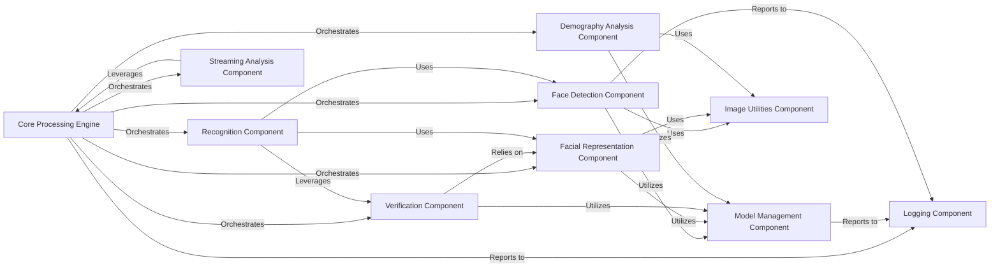

## Details

Overview of the DeepFace library's abstract components, focusing on the Core Processing Engine and its interactions with fundamental modules for facial analysis.

### Core Processing Engine [[Expand]](./Core_Processing_Engine.md)
The central orchestrator of the DeepFace library, responsible for coordinating and executing all high-level face-related tasks. It integrates and manages the execution flow between specialized modules for face detection, facial representation, verification, recognition, demography analysis, and real-time streaming, ensuring a cohesive and efficient facial analysis pipeline. It acts as the "brain" that ties together the various deep learning functionalities.

**Related Classes/Methods**:

- <a href="https://github.com/CodeBoarding/deepface/blob/master/.codeboarding/deepface/modules/detection.py#L0-L0" target="_blank" rel="noopener noreferrer">`deepface.modules.detection` (0:0)</a>
- <a href="https://github.com/CodeBoarding/deepface/blob/master/.codeboarding/deepface/modules/representation.py#L0-L0" target="_blank" rel="noopener noreferrer">`deepface.modules.representation` (0:0)</a>
- <a href="https://github.com/CodeBoarding/deepface/blob/master/.codeboarding/deepface/modules/verification.py#L0-L0" target="_blank" rel="noopener noreferrer">`deepface.modules.verification` (0:0)</a>
- <a href="https://github.com/CodeBoarding/deepface/blob/master/.codeboarding/deepface/modules/demography.py#L0-L0" target="_blank" rel="noopener noreferrer">`deepface.modules.demography` (0:0)</a>
- <a href="https://github.com/CodeBoarding/deepface/blob/master/.codeboarding/deepface/modules/recognition.py#L0-L0" target="_blank" rel="noopener noreferrer">`deepface.modules.recognition` (0:0)</a>
- <a href="https://github.com/CodeBoarding/deepface/blob/master/.codeboarding/deepface/modules/streaming.py#L0-L0" target="_blank" rel="noopener noreferrer">`deepface.modules.streaming` (0:0)</a>

### Model Management Component
Responsible for building, loading, and managing the various deep learning models (detectors, recognizers, demography models) required for face analysis. It ensures models are initialized and available.

**Related Classes/Methods**:

- <a href="https://github.com/CodeBoarding/deepface/blob/master/.codeboarding/deepface/modules/modeling.py#L0-L0" target="_blank" rel="noopener noreferrer">`deepface.modules.modeling` (0:0)</a>
- <a href="https://github.com/CodeBoarding/deepface/blob/master/.codeboarding/deepface/models/Detector.py#L9-L27" target="_blank" rel="noopener noreferrer">`deepface.models.Detector` (9:27)</a>
- <a href="https://github.com/CodeBoarding/deepface/blob/master/.codeboarding/deepface/models/FacialRecognition.py#L15-L47" target="_blank" rel="noopener noreferrer">`deepface.models.FacialRecognition` (15:47)</a>
- <a href="https://github.com/CodeBoarding/deepface/blob/master/.codeboarding/deepface/models/Demography.py#L15-L67" target="_blank" rel="noopener noreferrer">`deepface.models.Demography` (15:67)</a>

### Face Detection Component
Identifies and extracts facial regions from input images or video frames, providing normalized and aligned face images for subsequent processing. It's a prerequisite for most other tasks.

**Related Classes/Methods**:

- <a href="https://github.com/CodeBoarding/deepface/blob/master/.codeboarding/deepface/modules/detection.py#L0-L0" target="_blank" rel="noopener noreferrer">`deepface.modules.detection` (0:0)</a>
- `deepface.models.face_detection` (0:0)

### Facial Representation Component
Converts detected facial images into numerical embeddings (vectors) that capture unique facial features, enabling quantitative comparisons between faces.

**Related Classes/Methods**:

- <a href="https://github.com/CodeBoarding/deepface/blob/master/.codeboarding/deepface/modules/representation.py#L0-L0" target="_blank" rel="noopener noreferrer">`deepface.modules.representation` (0:0)</a>
- `deepface.models.facial_recognition` (0:0)

### Verification Component
Compares two facial embeddings to determine if they belong to the same individual, calculating distances and applying thresholds for identity confirmation.

**Related Classes/Methods**:

- <a href="https://github.com/CodeBoarding/deepface/blob/master/.codeboarding/deepface/modules/verification.py#L0-L0" target="_blank" rel="noopener noreferrer">`deepface.modules.verification` (0:0)</a>

### Recognition Component
Searches for a given face within a database of known faces, identifying potential matches based on facial embeddings and verification logic.

**Related Classes/Methods**:

- <a href="https://github.com/CodeBoarding/deepface/blob/master/.codeboarding/deepface/modules/recognition.py#L0-L0" target="_blank" rel="noopener noreferrer">`deepface.modules.recognition` (0:0)</a>

### Demography Analysis Component
Analyzes detected faces to predict demographic attributes such as age, gender, emotion, and race using specialized deep learning models.

**Related Classes/Methods**:

- <a href="https://github.com/CodeBoarding/deepface/blob/master/.codeboarding/deepface/modules/demography.py#L0-L0" target="_blank" rel="noopener noreferrer">`deepface.modules.demography` (0:0)</a>
- `deepface.models.demography` (0:0)

### Streaming Analysis Component
Manages the real-time processing of video streams for continuous face detection, recognition, and demographic analysis, applying other DeepFace functionalities in a live context.

**Related Classes/Methods**:

- <a href="https://github.com/CodeBoarding/deepface/blob/master/.codeboarding/deepface/modules/streaming.py#L0-L0" target="_blank" rel="noopener noreferrer">`deepface.modules.streaming` (0:0)</a>

### Image Utilities Component
Provides common utility functions for image loading, resizing, alignment, and basic manipulation, serving as a foundational support for all image-processing tasks.

**Related Classes/Methods**:

- <a href="https://github.com/CodeBoarding/deepface/blob/master/.codeboarding/deepface/commons/image_utils.py#L0-L0" target="_blank" rel="noopener noreferrer">`deepface.commons.image_utils` (0:0)</a>

### Logging Component
Handles the logging of information, warnings, and errors throughout the DeepFace system, providing crucial insights for debugging and monitoring.

**Related Classes/Methods**:

- <a href="https://github.com/CodeBoarding/deepface/blob/master/.codeboarding/deepface/commons/logger.py#L0-L0" target="_blank" rel="noopener noreferrer">`deepface.commons.logger` (0:0)</a>

### [FAQ](https://github.com/CodeBoarding/GeneratedOnBoardings/tree/main?tab=readme-ov-file#faq)
