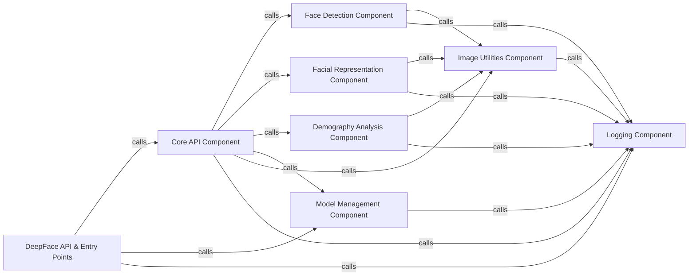

## Details

Abstract Components Overview: This section provides a detailed overview of the core components within the DeepFace library, focusing on their structure, purpose, and interactions. These components are fundamental to the library's functionality, enabling various facial analysis tasks from detection to recognition and demographic analysis.

### DeepFace API & Entry Points [[Expand]](./DeepFace_API_Entry_Points.md)
This component serves as the primary interface for users to interact with the DeepFace library. It encompasses both the direct Python API (`deepface.DeepFace`) for programmatic access and the web API (`deepface.api.src.app`, `deepface.api.src.modules.core.routes`, `deepface.api.src.modules.core.service`) for web-based requests. It handles initial user requests and delegates them for core processing.

**Related Classes/Methods**:

- <a href="https://github.com/CodeBoarding/deepface/blob/master/.codeboarding/deepface/DeepFace.py#L1-L1" target="_blank" rel="noopener noreferrer">`deepface.DeepFace` (1:1)</a>
- <a href="https://github.com/CodeBoarding/deepface/blob/master/.codeboarding/deepface/api/src/app.py#L1-L1" target="_blank" rel="noopener noreferrer">`deepface.api.src.app` (1:1)</a>
- <a href="https://github.com/CodeBoarding/deepface/blob/master/.codeboarding/deepface/api/src/modules/core/routes.py#L1-L1" target="_blank" rel="noopener noreferrer">`deepface.api.src.modules.core.routes` (1:1)</a>
- <a href="https://github.com/CodeBoarding/deepface/blob/master/.codeboarding/deepface/api/src/modules/core/service.py#L1-L1" target="_blank" rel="noopener noreferrer">`deepface.api.src.modules.core.service` (1:1)</a>

### Core API Component
This component orchestrates the main DeepFace functionalities, acting as a central hub that coordinates calls to other specialized components like face detection, facial representation, and demography analysis. It encapsulates the core logic for various DeepFace operations (e.g., `verify`, `analyze`, `find`).

**Related Classes/Methods**:

- <a href="https://github.com/CodeBoarding/deepface/blob/master/.codeboarding/deepface/DeepFace.py#L1-L1" target="_blank" rel="noopener noreferrer">`deepface.DeepFace` (1:1)</a>
- `deepface.commons.functions` (1:1)

### Model Management Component
Responsible for loading, caching, and managing the various deep learning models used by DeepFace for tasks like face detection, facial recognition, and demography analysis. It ensures models are efficiently loaded and available when needed, handling model-specific configurations and weights.

**Related Classes/Methods**:

- <a href="https://github.com/CodeBoarding/deepface/blob/master/.codeboarding/deepface/DeepFace.py#L1-L1" target="_blank" rel="noopener noreferrer">`deepface.DeepFace` (1:1)</a>
- `deepface.commons.functions` (1:1)
- `deepface.basemodels` (1:1)

### Face Detection Component
This component is dedicated to detecting faces within images. It provides an abstraction over various face detection algorithms (e.g., OpenCV, SSD, RetinaFace, MTCNN, MediaPipe, YuNet, YOLO, Dlib, CenterFace) and returns detected face regions. The `getClassHierarchy` output shows various `*Client` classes inheriting from `deepface.models.Detector.Detector`.

**Related Classes/Methods**:

- <a href="https://github.com/CodeBoarding/deepface/blob/master/.codeboarding/deepface/models/Detector.py#L9-L27" target="_blank" rel="noopener noreferrer">`deepface.models.Detector` (9:27)</a>
- `deepface.models.face_detection` (1:1)

### Facial Representation Component
This component is responsible for generating numerical representations (embeddings) of faces using various facial recognition models (e.g., ArcFace, FaceNet, DeepFace, VGG-Face, OpenFace, DeepID, Dlib, SFace, GhostFaceNet, Buffalo_L). These embeddings are crucial for tasks like verification and recognition. The `getClassHierarchy` output shows various `*Client` classes inheriting from `deepface.models.FacialRecognition.FacialRecognition`.

**Related Classes/Methods**:

- <a href="https://github.com/CodeBoarding/deepface/blob/master/.codeboarding/deepface/models/FacialRecognition.py#L15-L47" target="_blank" rel="noopener noreferrer">`deepface.models.FacialRecognition` (15:47)</a>
- `deepface.models.facial_recognition` (1:1)

### Demography Analysis Component
This component analyzes detected faces to predict demographic attributes such as age, emotion, gender, and race. It utilizes specialized models for each of these tasks. The `getClassHierarchy` output shows various `*Client` classes inheriting from `deepface.models.Demography.Demography`.

**Related Classes/Methods**:

- <a href="https://github.com/CodeBoarding/deepface/blob/master/.codeboarding/deepface/models/Demography.py#L15-L67" target="_blank" rel="noopener noreferrer">`deepface.models.Demography` (15:67)</a>
- `deepface.models.demography` (1:1)

### Image Utilities Component
Provides common image processing functionalities such as pre-processing, alignment, resizing, and normalization, which are essential for preparing images for face detection and analysis models.

**Related Classes/Methods**:

- `deepface.commons.functions` (1:1)

### Logging Component
Manages the logging of events, errors, and debugging information throughout the DeepFace library, aiding in monitoring and troubleshooting.

**Related Classes/Methods**:

- <a href="https://github.com/CodeBoarding/deepface/blob/master/.codeboarding/deepface/commons/logger.py#L1-L1" target="_blank" rel="noopener noreferrer">`deepface.commons.logger` (1:1)</a>

### [FAQ](https://github.com/CodeBoarding/GeneratedOnBoardings/tree/main?tab=readme-ov-file#faq)
