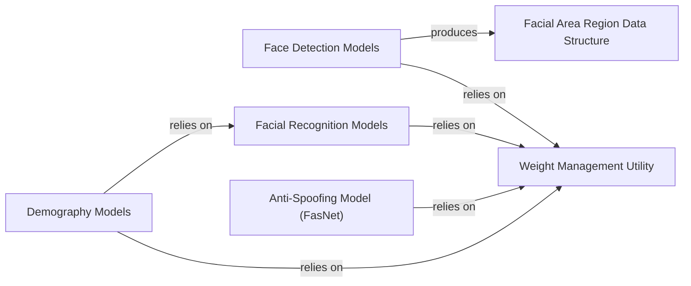

## Details

This subsystem encapsulates the core deep learning functionalities of `deepface`, providing specialized models for various facial analysis tasks. It is structured around distinct model types, a central utility for managing model weights, and a standardized data structure for detected faces.

### Face Detection Models
This component provides a collection of algorithms and models for accurately detecting human faces within images. Each specific detection model (e.g., CenterFaceClient, DlibClient, MediaPipeClient, OpenCvClient, YoloDetectorClient, YuNetClient, etc.) is implemented as a client class, all inheriting from the `deepface.models.Detector.Detector` base class. This design ensures a unified interface for face detection operations, consistently returning structured `FacialAreaRegion` data.

**Related Classes/Methods**:

- <a href="https://github.com/CodeBoarding/deepface/blob/master/.codeboarding/deepface/models/Detector.py#L9-L27" target="_blank" rel="noopener noreferrer">`deepface.models.Detector.Detector` (9:27)</a>
- <a href="https://github.com/CodeBoarding/deepface/blob/master/.codeboarding/deepface/models/face_detection/CenterFace.py#L20-L85" target="_blank" rel="noopener noreferrer">`deepface.models.face_detection.CenterFace.CenterFaceClient` (20:85)</a>
- <a href="https://github.com/CodeBoarding/deepface/blob/master/.codeboarding/deepface/models/face_detection/Dlib.py#L15-L104" target="_blank" rel="noopener noreferrer">`deepface.models.face_detection.Dlib.DlibClient` (15:104)</a>
- <a href="https://github.com/CodeBoarding/deepface/blob/master/.codeboarding/deepface/models/face_detection/MediaPipe.py#L11-L96" target="_blank" rel="noopener noreferrer">`deepface.models.face_detection.MediaPipe.MediaPipeClient` (11:96)</a>
- <a href="https://github.com/CodeBoarding/deepface/blob/master/.codeboarding/deepface/models/face_detection/OpenCv.py#L12-L175" target="_blank" rel="noopener noreferrer">`deepface.models.face_detection.OpenCv.OpenCvClient` (12:175)</a>
- <a href="https://github.com/CodeBoarding/deepface/blob/master/.codeboarding/deepface/models/face_detection/Yolo.py#L36-L121" target="_blank" rel="noopener noreferrer">`deepface.models.face_detection.Yolo.YoloDetectorClient` (36:121)</a>
- <a href="https://github.com/CodeBoarding/deepface/blob/master/.codeboarding/deepface/models/face_detection/YuNet.py#L19-L129" target="_blank" rel="noopener noreferrer">`deepface.models.face_detection.YuNet.YuNetClient` (19:129)</a>

### Facial Recognition Models
This component offers multiple pre-trained deep learning models designed for facial recognition, capable of generating high-dimensional embeddings (numerical representations) from face images. These embeddings are essential for tasks such as face verification (determining if two faces belong to the same person) or identification. Each model (e.g., ArcFaceClient, FaceNet128dClient, VggFaceClient, DeepIdClient, GhostFaceNetClient, OpenFaceClient, SFaceClient, DlibClient, Buffalo_L, DeepFaceClient) is represented by a client class inheriting from the `deepface.models.FacialRecognition.FacialRecognition` base class.

**Related Classes/Methods**:

- <a href="https://github.com/CodeBoarding/deepface/blob/master/.codeboarding/deepface/models/FacialRecognition.py#L15-L47" target="_blank" rel="noopener noreferrer">`deepface.models.FacialRecognition.FacialRecognition` (15:47)</a>
- <a href="https://github.com/CodeBoarding/deepface/blob/master/.codeboarding/deepface/models/facial_recognition/ArcFace.py#L47-L56" target="_blank" rel="noopener noreferrer">`deepface.models.facial_recognition.ArcFace.ArcFaceClient` (47:56)</a>
- <a href="https://github.com/CodeBoarding/deepface/blob/master/.codeboarding/deepface/models/facial_recognition/Facenet.py#L52-L61" target="_blank" rel="noopener noreferrer">`deepface.models.facial_recognition.Facenet.FaceNet128dClient` (52:61)</a>
- `deepface.models.facial_recognition.VggFace.VggFaceClient` (1:1)
- `deepface.models.facial_recognition.DeepId.DeepIdClient` (1:1)
- <a href="https://github.com/CodeBoarding/deepface/blob/master/.codeboarding/deepface/models/facial_recognition/GhostFaceNet.py#L53-L66" target="_blank" rel="noopener noreferrer">`deepface.models.facial_recognition.GhostFaceNet.GhostFaceNetClient` (53:66)</a>
- <a href="https://github.com/CodeBoarding/deepface/blob/master/.codeboarding/deepface/models/facial_recognition/OpenFace.py#L31-L40" target="_blank" rel="noopener noreferrer">`deepface.models.facial_recognition.OpenFace.OpenFaceClient` (31:40)</a>
- <a href="https://github.com/CodeBoarding/deepface/blob/master/.codeboarding/deepface/models/facial_recognition/SFace.py#L18-L49" target="_blank" rel="noopener noreferrer">`deepface.models.facial_recognition.SFace.SFaceClient` (18:49)</a>
- <a href="https://github.com/CodeBoarding/deepface/blob/master/.codeboarding/deepface/models/facial_recognition/Dlib.py#L17-L55" target="_blank" rel="noopener noreferrer">`deepface.models.facial_recognition.Dlib.DlibClient` (17:55)</a>
- <a href="https://github.com/CodeBoarding/deepface/blob/master/.codeboarding/deepface/models/facial_recognition/Buffalo_L.py#L10-L94" target="_blank" rel="noopener noreferrer">`deepface.models.facial_recognition.Buffalo_L.Buffalo_L` (10:94)</a>
- `deepface.models.facial_recognition.DeepFace.DeepFaceClient` (1:1)

### Demography Models
This component specializes in analyzing demographic attributes of detected faces, including age, emotion, gender, and race. It comprises specialized client classes (ApparentAgeClient, EmotionClient, GenderClient, RaceClient), all inheriting from the `deepface.models.Demography.Demography` base class. These models preprocess input, perform internal predictions, and derive demographic insights. Notably, the age, gender, and race prediction models leverage the VGGFaceClient from the Facial Recognition Models component for feature extraction.

**Related Classes/Methods**:

- <a href="https://github.com/CodeBoarding/deepface/blob/master/.codeboarding/deepface/models/Demography.py#L15-L67" target="_blank" rel="noopener noreferrer">`deepface.models.Demography.Demography` (15:67)</a>
- <a href="https://github.com/CodeBoarding/deepface/blob/master/.codeboarding/deepface/models/demography/Age.py#L32-L62" target="_blank" rel="noopener noreferrer">`deepface.models.demography.Age.ApparentAgeClient` (32:62)</a>
- <a href="https://github.com/CodeBoarding/deepface/blob/master/.codeboarding/deepface/models/demography/Emotion.py#L39-L79" target="_blank" rel="noopener noreferrer">`deepface.models.demography.Emotion.EmotionClient` (39:79)</a>
- <a href="https://github.com/CodeBoarding/deepface/blob/master/.codeboarding/deepface/models/demography/Gender.py#L34-L59" target="_blank" rel="noopener noreferrer">`deepface.models.demography.Gender.GenderClient` (34:59)</a>
- <a href="https://github.com/CodeBoarding/deepface/blob/master/.codeboarding/deepface/models/demography/Race.py#L33-L59" target="_blank" rel="noopener noreferrer">`deepface.models.demography.Race.RaceClient` (33:59)</a>

### Anti-Spoofing Model (FasNet)
This component is dedicated to detecting presentation attacks (spoofing) by analyzing facial images to determine if a real person is present or if it's a fake (e.g., photo, video replay). It includes the core `Fasnet` model and its associated backbone architectures (`MiniFASNetV2`, `MiniFASNetV1SE`), which are composed of various building blocks like `Conv_block`, `Depth_Wise`, `Linear_block`, `Residual`, and `SEModule` defined within `FasNetBackbone`.

**Related Classes/Methods**:

- <a href="https://github.com/CodeBoarding/deepface/blob/master/.codeboarding/deepface/models/spoofing/FasNet.py#L17-L139" target="_blank" rel="noopener noreferrer">`deepface.models.spoofing.FasNet.Fasnet` (17:139)</a>
- <a href="https://github.com/CodeBoarding/deepface/blob/master/.codeboarding/deepface/models/spoofing/FasNetBackbone.py#L127-L130" target="_blank" rel="noopener noreferrer">`deepface.models.spoofing.FasNetBackbone.MiniFASNetV2` (127:130)</a>
- <a href="https://github.com/CodeBoarding/deepface/blob/master/.codeboarding/deepface/models/spoofing/FasNetBackbone.py#L133-L138" target="_blank" rel="noopener noreferrer">`deepface.models.spoofing.FasNetBackbone.MiniFASNetV1SE` (133:138)</a>
- <a href="https://github.com/CodeBoarding/deepface/blob/master/.codeboarding/deepface/models/spoofing/FasNetBackbone.py#L146-L165" target="_blank" rel="noopener noreferrer">`deepface.models.spoofing.FasNetBackbone.Conv_block` (146:165)</a>
- <a href="https://github.com/CodeBoarding/deepface/blob/master/.codeboarding/deepface/models/spoofing/FasNetBackbone.py#L188-L213" target="_blank" rel="noopener noreferrer">`deepface.models.spoofing.FasNetBackbone.Depth_Wise` (188:213)</a>
- <a href="https://github.com/CodeBoarding/deepface/blob/master/.codeboarding/deepface/models/spoofing/FasNetBackbone.py#L168-L185" target="_blank" rel="noopener noreferrer">`deepface.models.spoofing.FasNetBackbone.Linear_block` (168:185)</a>
- <a href="https://github.com/CodeBoarding/deepface/blob/master/.codeboarding/deepface/models/spoofing/FasNetBackbone.py#L278-L301" target="_blank" rel="noopener noreferrer">`deepface.models.spoofing.FasNetBackbone.Residual` (278:301)</a>
- <a href="https://github.com/CodeBoarding/deepface/blob/master/.codeboarding/deepface/models/spoofing/FasNetBackbone.py#L255-L275" target="_blank" rel="noopener noreferrer">`deepface.models.spoofing.FasNetBackbone.SEModule` (255:275)</a>

### Weight Management Utility
This is a crucial utility component responsible for managing the lifecycle of pre-trained model weights. It handles downloading necessary weights from remote sources and loading them into the respective models, ensuring models are ready for inference. This component is fundamental as all other model components depend on it for initialization and operation.

**Related Classes/Methods**:

- `deepface.models.weight_utils` (1:1)

### Facial Area Region Data Structure
This component defines a standardized data structure (`FacialAreaRegion`), which inherits from `DetectedFace`. It is used across the face detection and other related modules to encapsulate the results of face detection, including bounding box coordinates and potentially facial landmarks. It provides a consistent output format for all face detectors.

**Related Classes/Methods**:

- <a href="https://github.com/CodeBoarding/deepface/blob/master/.codeboarding/deepface/models/Detector.py#L31-L57" target="_blank" rel="noopener noreferrer">`deepface.models.Detector.FacialAreaRegion` (31:57)</a>
- <a href="https://github.com/CodeBoarding/deepface/blob/master/.codeboarding/deepface/models/Detector.py#L61-L73" target="_blank" rel="noopener noreferrer">`deepface.models.Detector.DetectedFace` (61:73)</a>

### [FAQ](https://github.com/CodeBoarding/GeneratedOnBoardings/tree/main?tab=readme-ov-file#faq)
