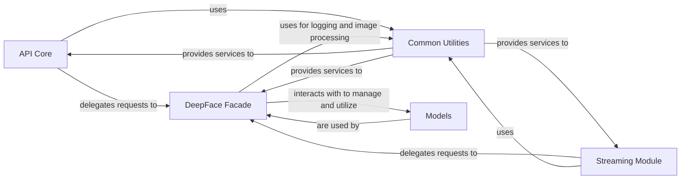

## Component Details

The `External Integration Layer` is a crucial component that acts as the primary interface between the DeepFace library and external applications or systems. It is designed to expose DeepFace's powerful facial analysis capabilities through well-defined interaction patterns, specifically a RESTful API and a real-time streaming module. This layer is fundamental because it enables DeepFace to be integrated into a wide array of applications, such as web services, mobile applications, or live video surveillance systems, without requiring direct Python code interaction from the external system.

### API Core

This component is responsible for handling all REST API interactions. It defines the various endpoints that external systems can call to access DeepFace functionalities (e.g., face verification, analysis, detection). It manages the parsing of incoming HTTP requests, validates the input data, orchestrates the calls to the underlying DeepFace functionalities, and formats the responses before sending them back to the client. It essentially translates HTTP requests into DeepFace operations and vice-versa.

**Related Classes/Methods**:

- <a href="https://github.com/serengil/deepface/blob/master/deepface/api/src/api.py#L1-L1" target="_blank" rel="noopener noreferrer">`deepface.api.src.api` (1:1)</a>

- <a href="https://github.com/serengil/deepface/blob/master/deepface/api/src/app.py#L1-L1" target="_blank" rel="noopener noreferrer">`deepface.api.src.app` (1:1)</a>

- <a href="https://github.com/serengil/deepface/blob/master/deepface/api/src/modules/core/routes.py#L1-L1" target="_blank" rel="noopener noreferrer">`deepface.api.src.modules.core.routes` (1:1)</a>

- <a href="https://github.com/serengil/deepface/blob/master/deepface/api/src/modules/core/service.py#L1-L1" target="_blank" rel="noopener noreferrer">`deepface.api.src.modules.core.service` (1:1)</a>

### Streaming Module

This component specializes in processing real-time video streams for continuous facial analysis. It handles the ingestion of video frames, applies DeepFace's face detection, recognition, and demography analysis algorithms to each frame, and can output the results in a continuous manner. This is essential for applications requiring live monitoring or interactive facial analysis.

**Related Classes/Methods**:

- <a href="https://github.com/serengil/deepface/blob/master/deepface/modules/streaming.py#L1-L1" target="_blank" rel="noopener noreferrer">`deepface.modules.streaming` (1:1)</a>

### DeepFace Facade

This component serves as the central entry point and a simplified interface to the core DeepFace functionalities. It orchestrates calls to various internal DeepFace modules (e.g., for facial representation, verification, analysis, detection, and model management). It abstracts away the complexity of the underlying deep learning models and their specific implementations, providing a clean and consistent API for higher-level components like the `API Core` and `Streaming Module`.

**Related Classes/Methods**:

- <a href="https://github.com/serengil/deepface/blob/master/deepface/DeepFace.py#L1-L1" target="_blank" rel="noopener noreferrer">`deepface.DeepFace` (1:1)</a>

### Common Utilities

This component provides a collection of shared utility functions and helper modules that are utilized across various parts of the DeepFace project, including the `External Integration Layer`. Key functionalities include robust logging for debugging and monitoring, and efficient image handling (loading, preprocessing, manipulation) which is critical for any image-based deep learning application.

**Related Classes/Methods**:

- <a href="https://github.com/serengil/deepface/blob/master/deepface/commons/logger.py#L1-L1" target="_blank" rel="noopener noreferrer">`deepface.commons.logger` (1:1)</a>

- <a href="https://github.com/serengil/deepface/blob/master/deepface/commons/image_utils.py#L1-L1" target="_blank" rel="noopener noreferrer">`deepface.commons.image_utils` (1:1)</a>

- <a href="https://github.com/serengil/deepface/blob/master/deepface/commons/package_utils.py#L1-L1" target="_blank" rel="noopener noreferrer">`deepface.commons.package_utils` (1:1)</a>

- <a href="https://github.com/serengil/deepface/blob/master/deepface/commons/folder_utils.py#L1-L1" target="_blank" rel="noopener noreferrer">`deepface.commons.folder_utils` (1:1)</a>

- <a href="https://github.com/serengil/deepface/blob/master/deepface/commons/weight_utils.py#L1-L1" target="_blank" rel="noopener noreferrer">`deepface.commons.weight_utils` (1:1)</a>

### Models

This component is responsible for defining, loading, and managing the various deep learning models used by DeepFace for its core tasks, such as facial recognition, face detection, and demography analysis (age, gender, emotion, race). It handles the instantiation and potentially caching of these models to optimize performance.

**Related Classes/Methods**:

- `deepface.models.demography` (1:1)

- `deepface.models.face_detection` (1:1)

- `deepface.models.facial_recognition` (1:1)

- `deepface.models.spoofing` (1:1)

### [FAQ](https://github.com/CodeBoarding/GeneratedOnBoardings/tree/main?tab=readme-ov-file#faq)