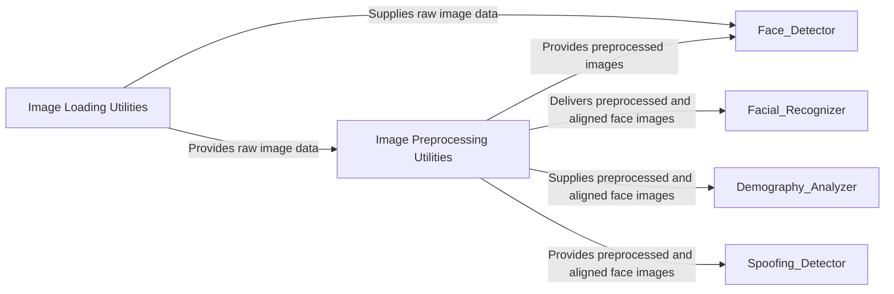

## Details

The Image & Preprocessing Utilities component serves as the foundational layer for all image-related operations within the system. It encompasses a crucial set of helper functions and modules dedicated to handling image data from its raw input state through various transformations, ensuring it is optimally prepared for subsequent deep learning model consumption. This includes functionalities for loading images from diverse sources, resizing them to required dimensions, and applying normalization techniques.

### Image Loading Utilities
This sub-component is solely responsible for abstracting the process of loading image data. It supports various input formats, including local file paths, web URLs, base64 encoded strings, and in-memory IO objects, converting them into a standardized NumPy array format. It also offers utilities for listing and hashing image files, facilitating efficient data management.

**Related Classes/Methods**:

- <a href="https://github.com/CodeBoarding/deepface/blob/master/.codeboarding/deepface/commons/image_utils.py#L1-L1" target="_blank" rel="noopener noreferrer">`deepface/commons/image_utils.py` (1:1)</a>

### Image Preprocessing Utilities [[Expand]](./Image_Preprocessing_Utilities.md)
This sub-component focuses on preparing image data for deep learning models. Its primary functions include resizing images to a target resolution and applying various normalization techniques to pixel values. These steps are critical to ensure consistency and optimal scale for model input.

**Related Classes/Methods**:

- <a href="https://github.com/CodeBoarding/deepface/blob/master/.codeboarding/deepface/modules/preprocessing.py#L1-L1" target="_blank" rel="noopener noreferrer">`deepface/modules/preprocessing.py` (1:1)</a>

### [FAQ](https://github.com/CodeBoarding/GeneratedOnBoardings/tree/main?tab=readme-ov-file#faq)
