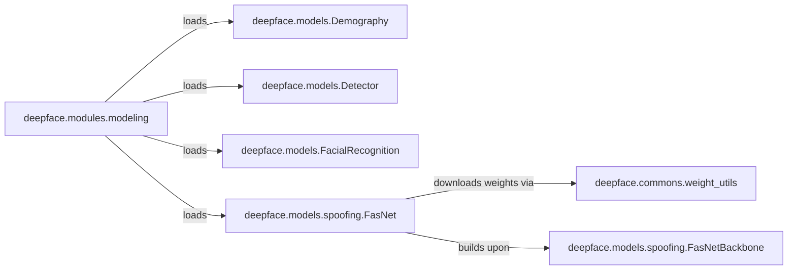

## Component Details

The Model Management System in DeepFace is crucial for handling the diverse range of deep learning models used for facial recognition, detection, demography, and anti-spoofing. It provides a unified and efficient way to load, manage, and utilize these models, abstracting away the underlying complexities of different backends and ensuring pre-trained weights are readily available.

### deepface.modules.modeling

This module acts as the central orchestrator for the Model Management System. Its primary function, `build_model`, is responsible for dynamically loading and caching various deep learning models (facial recognition, detection, demography, anti-spoofing) based on the requested task and model name. It ensures that models are loaded efficiently, often employing a singleton pattern to reuse already initialized models, thereby providing a unified interface for the rest of the DeepFace system to access pre-trained models.

**Related Classes/Methods**:

- <a href="https://github.com/serengil/deepface/blob/master/deepface/modules/modeling.py#L32-L104" target="_blank" rel="noopener noreferrer">`deepface.modules.modeling:build_model` (32:104)</a>

### deepface.commons.weight_utils

This utility module is vital for managing pre-trained model weights. Its core function, `download_weights_if_necessary`, handles the downloading, caching, and verification of model weights from external URLs. It supports various compression types and ensures that the necessary model files are available locally before models are loaded, directly addressing the system's need for efficient weight management and utilization.

**Related Classes/Methods**:

- <a href="https://github.com/serengil/deepface/blob/master/deepface/commons/weight_utils.py#L27-L76" target="_blank" rel="noopener noreferrer">`deepface.commons.weight_utils:download_weights_if_necessary` (27:76)</a>

### deepface.models.Demography

This is an abstract base class that defines the common interface and structure for all demography-related models (e.g., age, gender, emotion, race prediction) within DeepFace. It specifies methods like `predict` and internal preprocessing utilities, ensuring a consistent API for demography models.

**Related Classes/Methods**:

- <a href="https://github.com/serengil/deepface/blob/master/deepface/models/Demography.py#L20-L21" target="_blank" rel="noopener noreferrer">`deepface.models.Demography:predict` (20:21)</a>

### deepface.models.Detector

This abstract base class defines the common interface and structure for all face detection models (e.g., OpenCV, MTCNN, RetinaFace) within DeepFace. It specifies the `detect_faces` method, which is crucial for locating facial areas in images before further analysis.

**Related Classes/Methods**:

- <a href="https://github.com/serengil/deepface/blob/master/deepface/models/Detector.py#L11-L27" target="_blank" rel="noopener noreferrer">`deepface.models.Detector:detect_faces` (11:27)</a>

### deepface.models.FacialRecognition

This abstract base class defines the common interface and structure for all facial recognition models (e.g., VGG-Face, FaceNet, ArcFace) within DeepFace. It specifies the `forward` method for generating facial embeddings, which are central to identity verification and recognition tasks.

**Related Classes/Methods**:

- <a href="https://github.com/serengil/deepface/blob/master/deepface/models/FacialRecognition.py#L21-L47" target="_blank" rel="noopener noreferrer">`deepface.models.FacialRecognition:forward` (21:47)</a>

### deepface.models.spoofing.FasNet

This class represents a concrete implementation of an anti-spoofing model, specifically the Mini Face Anti Spoofing Net. It demonstrates how specific deep learning models are structured, initialized, and integrated into the DeepFace system, including the loading of its specific pre-trained weights and performing anti-spoofing analysis.

**Related Classes/Methods**:

- <a href="https://github.com/serengil/deepface/blob/master/deepface/models/spoofing/FasNet.py#L1-L1" target="_blank" rel="noopener noreferrer">`deepface.models.spoofing.FasNet` (1:1)</a>

### deepface.models.spoofing.FasNetBackbone

This module defines the core neural network architectures, such as `MiniFASNet`, that serve as the backbone for anti-spoofing models like `FasNet`. It encapsulates the complex convolutional layers, depth-wise separable convolutions, and residual blocks that form the deep learning model's structure.

**Related Classes/Methods**:

- <a href="https://github.com/serengil/deepface/blob/master/deepface/models/spoofing/FasNetBackbone.py#L356-L465" target="_blank" rel="noopener noreferrer">`deepface.models.spoofing.FasNetBackbone:MiniFASNet` (356:465)</a>

### [FAQ](https://github.com/CodeBoarding/GeneratedOnBoardings/tree/main?tab=readme-ov-file#faq)