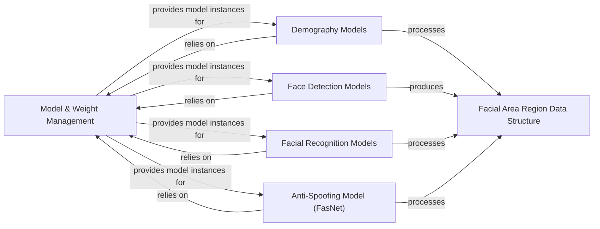

## Details

This section provides a detailed overview of the `Model & Weight Management` component within the DeepFace library, along with its closely related components. These components are fundamental to the library's operation, enabling the dynamic loading, management, and application of various deep learning models for facial analysis tasks.

### Model & Weight Management [[Expand]](./Model_Weight_Management.md)
This component is the central factory and manager for all deep learning models within DeepFace. It is responsible for dynamically loading, building, caching, and ensuring the availability of various pre-trained models and their associated weights. It abstracts the complexities of model instantiation and weight handling, providing a unified interface for accessing different model types (demography, face detection, facial recognition, anti-spoofing).

**Related Classes/Methods**:

- <a href="https://github.com/CodeBoarding/deepface/blob/master/.codeboarding/deepface/modules/modeling.py#L0-L0" target="_blank" rel="noopener noreferrer">`deepface.modules.modeling` (0:0)</a>
- <a href="https://github.com/CodeBoarding/deepface/blob/master/.codeboarding/deepface/commons/weight_utils.py#L0-L0" target="_blank" rel="noopener noreferrer">`deepface.commons.weight_utils` (0:0)</a>

### Demography Models
This component encapsulates the logic and models for analyzing demographic attributes (age, emotion, gender, race) from detected faces. It provides specialized client classes for each attribute, all inheriting from a common `Demography` base class, ensuring a consistent interface for demographic analysis.

**Related Classes/Methods**:

- <a href="https://github.com/CodeBoarding/deepface/blob/master/.codeboarding/deepface/models/Demography.py#L15-L67" target="_blank" rel="noopener noreferrer">`deepface.models.Demography.Demography` (15:67)</a>
- <a href="https://github.com/CodeBoarding/deepface/blob/master/.codeboarding/deepface/models/demography/Age.py#L32-L62" target="_blank" rel="noopener noreferrer">`deepface.models.demography.Age.ApparentAgeClient` (32:62)</a>
- <a href="https://github.com/CodeBoarding/deepface/blob/master/.codeboarding/deepface/models/demography/Emotion.py#L39-L79" target="_blank" rel="noopener noreferrer">`deepface.models.demography.Emotion.EmotionClient` (39:79)</a>
- <a href="https://github.com/CodeBoarding/deepface/blob/master/.codeboarding/deepface/models/demography/Gender.py#L34-L59" target="_blank" rel="noopener noreferrer">`deepface.models.demography.Gender.GenderClient` (34:59)</a>
- <a href="https://github.com/CodeBoarding/deepface/blob/master/.codeboarding/deepface/models/demography/Race.py#L33-L59" target="_blank" rel="noopener noreferrer">`deepface.models.demography.Race.RaceClient` (33:59)</a>

### Face Detection Models
This component provides a collection of algorithms and models specifically designed for detecting human faces within images. Each detection model is implemented as a client class inheriting from a `Detector` base class, offering a standardized way to perform face detection and return structured `FacialAreaRegion` data.

**Related Classes/Methods**:

- <a href="https://github.com/CodeBoarding/deepface/blob/master/.codeboarding/deepface/models/Detector.py#L9-L27" target="_blank" rel="noopener noreferrer">`deepface.models.Detector.Detector` (9:27)</a>
- <a href="https://github.com/CodeBoarding/deepface/blob/master/.codeboarding/deepface/models/face_detection/CenterFace.py#L20-L85" target="_blank" rel="noopener noreferrer">`deepface.models.face_detection.CenterFace.CenterFaceClient` (20:85)</a>
- <a href="https://github.com/CodeBoarding/deepface/blob/master/.codeboarding/deepface/models/face_detection/Dlib.py#L15-L104" target="_blank" rel="noopener noreferrer">`deepface.models.face_detection.Dlib.DlibClient` (15:104)</a>
- <a href="https://github.com/CodeBoarding/deepface/blob/master/.codeboarding/deepface/models/face_detection/MediaPipe.py#L11-L96" target="_blank" rel="noopener noreferrer">`deepface.models.face_detection.MediaPipe.MediaPipeClient` (11:96)</a>
- <a href="https://github.com/CodeBoarding/deepface/blob/master/.codeboarding/deepface/models/face_detection/OpenCv.py#L12-L175" target="_blank" rel="noopener noreferrer">`deepface.models.face_detection.OpenCv.OpenCvClient` (12:175)</a>
- <a href="https://github.com/CodeBoarding/deepface/blob/master/.codeboarding/deepface/models/face_detection/Yolo.py#L36-L121" target="_blank" rel="noopener noreferrer">`deepface.models.face_detection.Yolo.YoloDetectorClient` (36:121)</a>

### Facial Recognition Models
This component houses various pre-trained models for facial recognition, enabling the generation of high-dimensional embeddings from face images. These embeddings are crucial for tasks like face verification and identification. Each model is represented by a client class inheriting from the `FacialRecognition` base class.

**Related Classes/Methods**:

- <a href="https://github.com/CodeBoarding/deepface/blob/master/.codeboarding/deepface/models/FacialRecognition.py#L15-L47" target="_blank" rel="noopener noreferrer">`deepface.models.FacialRecognition.FacialRecognition` (15:47)</a>
- <a href="https://github.com/CodeBoarding/deepface/blob/master/.codeboarding/deepface/models/facial_recognition/ArcFace.py#L47-L56" target="_blank" rel="noopener noreferrer">`deepface.models.facial_recognition.ArcFace.ArcFaceClient` (47:56)</a>
- <a href="https://github.com/CodeBoarding/deepface/blob/master/.codeboarding/deepface/models/facial_recognition/Facenet.py#L52-L61" target="_blank" rel="noopener noreferrer">`deepface.models.facial_recognition.Facenet.FaceNet128dClient` (52:61)</a>
- <a href="https://github.com/CodeBoarding/deepface/blob/master/.codeboarding/deepface/models/facial_recognition/VGGFace.py#L46-L77" target="_blank" rel="noopener noreferrer">`deepface.models.facial_recognition.VGGFace.VggFaceClient` (46:77)</a>

### Anti-Spoofing Model (FasNet)
This component is dedicated to detecting presentation attacks (spoofing) by analyzing facial images to determine if a real person is present or if it's a fake (e.g., photo, video replay). It includes the core `FasNet` model and its associated backbone architectures.

**Related Classes/Methods**:

- <a href="https://github.com/CodeBoarding/deepface/blob/master/.codeboarding/deepface/models/spoofing/FasNet.py#L0-L0" target="_blank" rel="noopener noreferrer">`deepface.models.spoofing.FasNet.FasNet` (0:0)</a>
- <a href="https://github.com/CodeBoarding/deepface/blob/master/.codeboarding/deepface/models/spoofing/FasNetBackbone.py#L127-L130" target="_blank" rel="noopener noreferrer">`deepface.models.spoofing.FasNetBackbone.MiniFASNetV2` (127:130)</a>
- <a href="https://github.com/CodeBoarding/deepface/blob/master/.codeboarding/deepface/models/spoofing/FasNetBackbone.py#L133-L138" target="_blank" rel="noopener noreferrer">`deepface.models.spoofing.FasNetBackbone.MiniFASNetV1SE` (133:138)</a>

### Facial Area Region Data Structure
This component defines a standardized data structure (`FacialAreaRegion`) used across the face detection and other related modules to encapsulate the results of face detection, including bounding box coordinates and potentially facial landmarks. It ensures consistent data exchange between components.

**Related Classes/Methods**:

- <a href="https://github.com/CodeBoarding/deepface/blob/master/.codeboarding/deepface/models/Detector.py#L31-L57" target="_blank" rel="noopener noreferrer">`deepface.models.Detector.FacialAreaRegion` (31:57)</a>

### [FAQ](https://github.com/CodeBoarding/GeneratedOnBoardings/tree/main?tab=readme-ov-file#faq)
