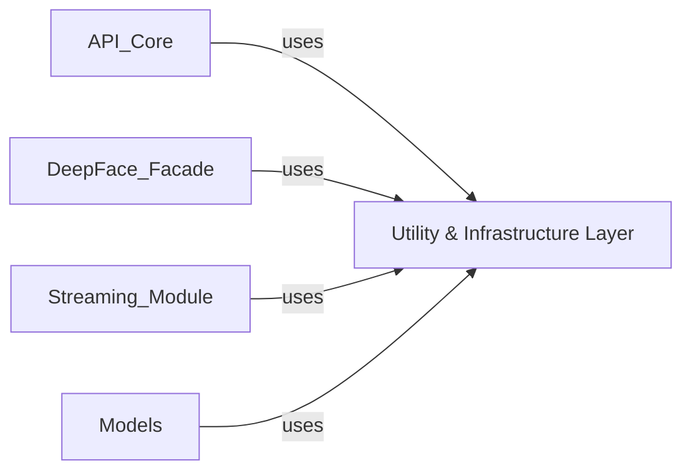

## Component Details

Analysis of the Utility & Infrastructure Layer within the DeepFace library, detailing its components, purpose, and relationships with other key modules. This layer provides foundational services like image handling, logging, file system operations, and model weight management, which are crucial for the entire DeepFace library's functionality and efficiency. It serves as a bedrock for components such as API Core, DeepFace Facade, Streaming Module, and Models, ensuring reusability and consistency across the application by centralizing common, non-domain-specific functionalities.

### Utility & Infrastructure Layer

This foundational component provides essential helper functions and cross-cutting concerns used throughout the entire DeepFace library. It includes utilities for image loading and manipulation, centralized logging, file system operations, package-related utilities, constants, and crucially, utilities for managing and loading model weights. It ensures consistency and efficiency for common, non-domain-specific tasks.

**Related Classes/Methods**:

- <a href="https://github.com/serengil/deepface/blob/master/deepface/commons/constant.py#L0-L0" target="_blank" rel="noopener noreferrer">`constant` (0:0)</a>

- <a href="https://github.com/serengil/deepface/blob/master/deepface/commons/folder_utils.py#L0-L0" target="_blank" rel="noopener noreferrer">`folder_utils` (0:0)</a>

- <a href="https://github.com/serengil/deepface/blob/master/deepface/commons/image_utils.py#L0-L0" target="_blank" rel="noopener noreferrer">`image_utils` (0:0)</a>

- <a href="https://github.com/serengil/deepface/blob/master/deepface/commons/logger.py#L0-L0" target="_blank" rel="noopener noreferrer">`logger` (0:0)</a>

- <a href="https://github.com/serengil/deepface/blob/master/deepface/commons/package_utils.py#L0-L0" target="_blank" rel="noopener noreferrer">`package_utils` (0:0)</a>

- <a href="https://github.com/serengil/deepface/blob/master/deepface/commons/weight_utils.py#L0-L0" target="_blank" rel="noopener noreferrer">`weight_utils` (0:0)</a>

### [FAQ](https://github.com/CodeBoarding/GeneratedOnBoardings/tree/main?tab=readme-ov-file#faq)