```mermaid

graph LR

    DeepFace_Public_API["DeepFace Public API"]

    Model_Management_System["Model Management System"]

    Facial_Analysis_Engine["Facial Analysis Engine"]

    Utility_Infrastructure_Layer["Utility & Infrastructure Layer"]

    External_Integration_Layer["External Integration Layer"]

    DeepFace_Public_API -- "Delegates to" --> Facial_Analysis_Engine

    DeepFace_Public_API -- "Delegates to" --> Model_Management_System

    Model_Management_System -- "Provides models to" --> Facial_Analysis_Engine

    Model_Management_System -- "Uses" --> Utility_Infrastructure_Layer

    Facial_Analysis_Engine -- "Requests models from" --> Model_Management_System

    Facial_Analysis_Engine -- "Uses" --> Utility_Infrastructure_Layer

    Utility_Infrastructure_Layer -- "Supports" --> DeepFace_Public_API

    Utility_Infrastructure_Layer -- "Supports" --> Model_Management_System

    Utility_Infrastructure_Layer -- "Supports" --> Facial_Analysis_Engine

    Utility_Infrastructure_Layer -- "Supports" --> External_Integration_Layer

    External_Integration_Layer -- "Invokes" --> DeepFace_Public_API

    External_Integration_Layer -- "Uses" --> Utility_Infrastructure_Layer

    click Model_Management_System href "https://github.com/serengil/deepface/blob/main/.codeboarding//Model_Management_System.md" "Details"

    click Facial_Analysis_Engine href "https://github.com/serengil/deepface/blob/main/.codeboarding//Facial_Analysis_Engine.md" "Details"

    click Utility_Infrastructure_Layer href "https://github.com/serengil/deepface/blob/main/.codeboarding//Utility_Infrastructure_Layer.md" "Details"

    click External_Integration_Layer href "https://github.com/serengil/deepface/blob/main/.codeboarding//External_Integration_Layer.md" "Details"

```

## Component Details

Final Architecture Analysis for `deepface`

Based on the Control Flow Graph (CFG) and Source Code analysis, the `deepface` project's architecture can be effectively summarized into five fundamental components. These components are chosen for their distinct responsibilities, high cohesion, and critical roles in the overall system's operation.

Why these components are fundamental:

These five components represent a clear and logical separation of concerns within the `deepface` project, making the architecture modular, maintainable, and scalable.

1.  **DeepFace Public API**: This is fundamental because it defines the user experience and the primary interaction model with the library. It abstracts internal complexities, providing a clean and stable interface for developers.

2.  **Model Management System**: DeepFace is built upon deep learning models. This component is absolutely critical for handling the acquisition, loading, and efficient management of these models, which are the core intellectual property and functional backbone of the library. Without it, every analysis task would need to manage its own model lifecycle.

3.  **Facial Analysis Engine**: This is the "brain" of DeepFace, where all the specialized algorithms for face detection, recognition, and attribute analysis reside. It's fundamental because it encapsulates the core domain logic and the complex computational tasks that define the library's purpose.

4.  **Utility & Infrastructure Layer**: This component provides essential cross-cutting services that are required by almost every other part of the system (e.g., logging, image handling). It's fundamental for ensuring consistency, reducing code duplication, and providing a robust foundation for the entire application.

5.  **External Integration Layer**: This component is crucial for the broader applicability and deployability of DeepFace. By providing a REST API and streaming capabilities, it allows the library to be consumed by various applications and systems beyond direct Python scripting, making it a versatile and production-ready solution.

Together, these components form a cohesive and well-structured architecture that effectively manages the complexities of deep learning-based facial analysis, from model management to user interaction and external integration.

### DeepFace Public API

This component serves as the primary public interface and orchestration layer for the entire DeepFace library. It provides high-level, user-friendly functions (`verify`, `analyze`, `represent`, `find`, `stream`, `extract_faces`, `build_model`) that abstract the underlying complexities of facial analysis. It acts as a facade, delegating tasks to specialized internal modules and ensuring a clean, consistent API for consumers.

**Related Classes/Methods**:

- <a href="https://github.com/serengil/deepface/blob/master/deepface/DeepFace.py#L1-L1000" target="_blank" rel="noopener noreferrer">`deepface.DeepFace` (1:1000)</a>

### Model Management System

This component is responsible for the lifecycle management of all deep learning models used by DeepFace. This includes dynamic loading, building, caching, and ensuring that pre-trained model weights are correctly downloaded and utilized. It abstracts the complexities of various model backends (e.g., TensorFlow, Keras) and provides a unified interface for accessing different types of models (facial recognition, detection, demography, anti-spoofing).

**Related Classes/Methods**:

- <a href="https://github.com/serengil/deepface/blob/master/deepface/modules/modeling.py#L1-L1000" target="_blank" rel="noopener noreferrer">`deepface.modules.modeling` (1:1000)</a>

- <a href="https://github.com/serengil/deepface/blob/master/deepface/commons/weight_utils.py#L1-L1000" target="_blank" rel="noopener noreferrer">`deepface.commons.weight_utils` (1:1000)</a>

- <a href="https://github.com/serengil/deepface/blob/master/deepface/models/Demography.py#L15-L67" target="_blank" rel="noopener noreferrer">`deepface.models.Demography` (15:67)</a>

- <a href="https://github.com/serengil/deepface/blob/master/deepface/models/Detector.py#L9-L27" target="_blank" rel="noopener noreferrer">`deepface.models.Detector` (9:27)</a>

- <a href="https://github.com/serengil/deepface/blob/master/deepface/models/FacialRecognition.py#L15-L47" target="_blank" rel="noopener noreferrer">`deepface.models.FacialRecognition` (15:47)</a>

- <a href="https://github.com/serengil/deepface/blob/master/deepface/models/spoofing/FasNet.py#L1-L1000" target="_blank" rel="noopener noreferrer">`deepface.models.spoofing.FasNet` (1:1000)</a>

### Facial Analysis Engine

This is the algorithmic core of DeepFace, containing the specialized modules that perform the actual facial analysis tasks. Each module within this component handles a specific aspect: face detection, facial representation (embedding generation), identity verification, identity recognition, demographic attribute prediction (age, gender, emotion, race), and image preprocessing (alignment, normalization). It encapsulates the complex machine learning logic.

**Related Classes/Methods**:

- <a href="https://github.com/serengil/deepface/blob/master/deepface/modules/detection.py#L1-L1000" target="_blank" rel="noopener noreferrer">`deepface.modules.detection` (1:1000)</a>

- <a href="https://github.com/serengil/deepface/blob/master/deepface/modules/representation.py#L1-L1000" target="_blank" rel="noopener noreferrer">`deepface.modules.representation` (1:1000)</a>

- <a href="https://github.com/serengil/deepface/blob/master/deepface/modules/verification.py#L1-L1000" target="_blank" rel="noopener noreferrer">`deepface.modules.verification` (1:1000)</a>

- <a href="https://github.com/serengil/deepface/blob/master/deepface/modules/recognition.py#L1-L1000" target="_blank" rel="noopener noreferrer">`deepface.modules.recognition` (1:1000)</a>

- <a href="https://github.com/serengil/deepface/blob/master/deepface/modules/demography.py#L1-L1000" target="_blank" rel="noopener noreferrer">`deepface.modules.demography` (1:1000)</a>

- <a href="https://github.com/serengil/deepface/blob/master/deepface/modules/preprocessing.py#L1-L1000" target="_blank" rel="noopener noreferrer">`deepface.modules.preprocessing` (1:1000)</a>

### Utility & Infrastructure Layer

This foundational component provides essential helper functions and cross-cutting concerns used throughout the entire DeepFace library. It includes utilities for image loading and manipulation, centralized logging, file system operations, package-related utilities, and constants. It ensures consistency and efficiency for common, non-domain-specific tasks.

**Related Classes/Methods**:

- <a href="https://github.com/serengil/deepface/blob/master/deepface/commons/image_utils.py#L1-L1000" target="_blank" rel="noopener noreferrer">`deepface.commons.image_utils` (1:1000)</a>

- <a href="https://github.com/serengil/deepface/blob/master/deepface/commons/logger.py#L1-L1000" target="_blank" rel="noopener noreferrer">`deepface.commons.logger` (1:1000)</a>

- <a href="https://github.com/serengil/deepface/blob/master/deepface/commons/folder_utils.py#L1-L1000" target="_blank" rel="noopener noreferrer">`deepface.commons.folder_utils` (1:1000)</a>

- <a href="https://github.com/serengil/deepface/blob/master/deepface/commons/package_utils.py#L1-L1000" target="_blank" rel="noopener noreferrer">`deepface.commons.package_utils` (1:1000)</a>

- <a href="https://github.com/serengil/deepface/blob/master/deepface/commons/constant.py#L1-L1000" target="_blank" rel="noopener noreferrer">`deepface.commons.constant` (1:1000)</a>

### External Integration Layer

This component is responsible for exposing DeepFace functionalities to external systems and handling specific interaction patterns beyond direct Python function calls. It primarily includes the REST API, which defines endpoints, parses incoming HTTP requests, and formats responses, and the streaming module, which manages real-time facial analysis from video feeds. It acts as the bridge for integrating DeepFace into web applications or live video processing pipelines.

**Related Classes/Methods**:

- <a href="https://github.com/serengil/deepface/blob/master/deepface/api/src/api.py#L1-L1000" target="_blank" rel="noopener noreferrer">`deepface.api.src.api` (1:1000)</a>

- <a href="https://github.com/serengil/deepface/blob/master/deepface/api/src/app.py#L1-L1000" target="_blank" rel="noopener noreferrer">`deepface.api.src.app` (1:1000)</a>

- <a href="https://github.com/serengil/deepface/blob/master/deepface/api/src/modules/core/routes.py#L1-L1000" target="_blank" rel="noopener noreferrer">`deepface.api.src.modules.core.routes` (1:1000)</a>

- <a href="https://github.com/serengil/deepface/blob/master/deepface/api/src/modules/core/service.py#L1-L1000" target="_blank" rel="noopener noreferrer">`deepface.api.src.modules.core.service` (1:1000)</a>

- <a href="https://github.com/serengil/deepface/blob/master/deepface/modules/streaming.py#L1-L1000" target="_blank" rel="noopener noreferrer">`deepface.modules.streaming` (1:1000)</a>

### [FAQ](https://github.com/CodeBoarding/GeneratedOnBoardings/tree/main?tab=readme-ov-file#faq)