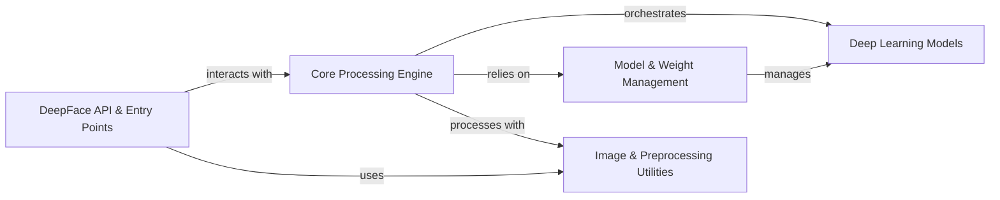

## Details

High-level data flow overview of the `deepface` project, identifying its central modules, their responsibilities, and their interactions.

### DeepFace API & Entry Points [[Expand]](./DeepFace_API_Entry_Points.md)
This component serves as the primary interface for users to interact with the DeepFace library. It encompasses both the direct Python API (`deepface.DeepFace`) for programmatic access and the web API (`deepface.api.src.app`, `deepface.api.src.modules.core.routes`, `deepface.api.src.modules.core.service`) for web-based requests. It handles initial user requests and delegates them for core processing.

**Related Classes/Methods**:

- <a href="https://github.com/CodeBoarding/deepface/blob/master/.codeboarding/deepface/DeepFace.py#L1-L1" target="_blank" rel="noopener noreferrer">`deepface.DeepFace` (1:1)</a>
- <a href="https://github.com/CodeBoarding/deepface/blob/master/.codeboarding/deepface/api/src/app.py#L1-L1" target="_blank" rel="noopener noreferrer">`deepface.api.src.app` (1:1)</a>
- <a href="https://github.com/CodeBoarding/deepface/blob/master/.codeboarding/deepface/api/src/modules/core/routes.py#L1-L1" target="_blank" rel="noopener noreferrer">`deepface.api.src.modules.core.routes` (1:1)</a>
- <a href="https://github.com/CodeBoarding/deepface/blob/master/.codeboarding/deepface/api/src/modules/core/service.py#L1-L1" target="_blank" rel="noopener noreferrer">`deepface.api.src.modules.core.service` (1:1)</a>

### Core Processing Engine [[Expand]](./Core_Processing_Engine.md)
The heart of the DeepFace library, this component implements the core logic for all face-related tasks such as detection, representation, verification, demography analysis, recognition, and streaming. It orchestrates the execution flow by calling specific deep learning models and utility functions.

**Related Classes/Methods**:

- <a href="https://github.com/CodeBoarding/deepface/blob/master/.codeboarding/deepface/modules/detection.py#L1-L1" target="_blank" rel="noopener noreferrer">`deepface.modules.detection` (1:1)</a>
- <a href="https://github.com/CodeBoarding/deepface/blob/master/.codeboarding/deepface/modules/representation.py#L1-L1" target="_blank" rel="noopener noreferrer">`deepface.modules.representation` (1:1)</a>
- <a href="https://github.com/CodeBoarding/deepface/blob/master/.codeboarding/deepface/modules/verification.py#L1-L1" target="_blank" rel="noopener noreferrer">`deepface.modules.verification` (1:1)</a>
- <a href="https://github.com/CodeBoarding/deepface/blob/master/.codeboarding/deepface/modules/demography.py#L1-L1" target="_blank" rel="noopener noreferrer">`deepface.modules.demography` (1:1)</a>
- <a href="https://github.com/CodeBoarding/deepface/blob/master/.codeboarding/deepface/modules/recognition.py#L1-L1" target="_blank" rel="noopener noreferrer">`deepface.modules.recognition` (1:1)</a>
- <a href="https://github.com/CodeBoarding/deepface/blob/master/.codeboarding/deepface/modules/streaming.py#L1-L1" target="_blank" rel="noopener noreferrer">`deepface.modules.streaming` (1:1)</a>

### Model & Weight Management [[Expand]](./Model_Weight_Management.md)
This component is responsible for the dynamic loading, building, caching, and management of various pre-trained deep learning models and their associated weights. It ensures that the necessary models and their parameters are available to the Core Processing Engine when required.

**Related Classes/Methods**:

- <a href="https://github.com/CodeBoarding/deepface/blob/master/.codeboarding/deepface/modules/modeling.py#L1-L1" target="_blank" rel="noopener noreferrer">`deepface.modules.modeling` (1:1)</a>
- <a href="https://github.com/CodeBoarding/deepface/blob/master/.codeboarding/deepface/commons/weight_utils.py#L1-L1" target="_blank" rel="noopener noreferrer">`deepface.commons.weight_utils` (1:1)</a>

### Deep Learning Models [[Expand]](./Deep_Learning_Models.md)
This component comprises the actual implementations of specialized deep learning models used for different facial analysis tasks. This includes models for face detection, facial recognition (embedding generation), demography prediction (age, gender, emotion, race), and presentation attack detection (spoofing).

**Related Classes/Methods**:

- `deepface.models.demography` (1:1)
- `deepface.models.face_detection` (1:1)
- `deepface.models.facial_recognition` (1:1)
- `deepface.models.spoofing` (1:1)

### Image & Preprocessing Utilities [[Expand]](./Image_Preprocessing_Utilities.md)
A collection of essential helper functions for handling image data. This includes functionalities for loading, resizing, aligning, normalizing, and general manipulation of images, which are crucial steps before feeding images into deep learning models.

**Related Classes/Methods**:

- <a href="https://github.com/CodeBoarding/deepface/blob/master/.codeboarding/deepface/commons/image_utils.py#L1-L1" target="_blank" rel="noopener noreferrer">`deepface.commons.image_utils` (1:1)</a>
- <a href="https://github.com/CodeBoarding/deepface/blob/master/.codeboarding/deepface/modules/preprocessing.py#L1-L1" target="_blank" rel="noopener noreferrer">`deepface.modules.preprocessing` (1:1)</a>

### [FAQ](https://github.com/CodeBoarding/GeneratedOnBoardings/tree/main?tab=readme-ov-file#faq)
