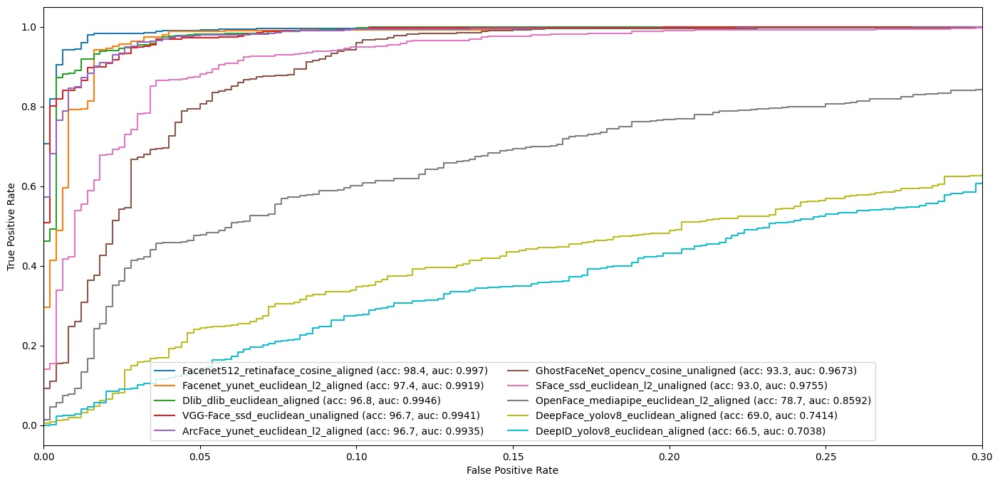

# Benchmarks

DeepFace offers various configurations that significantly impact accuracy, including the facial recognition model, face detector model, distance metric, and alignment mode. Our experiments conducted on the [LFW dataset](https://sefiks.com/2020/08/27/labeled-faces-in-the-wild-for-face-recognition/) using different combinations of these configurations yield the following results.

You can reproduce the results by executing the `Perform-Experiments.ipynb` and `Evaluate-Results.ipynb` notebooks, respectively.

## ROC Curves

ROC curves provide a valuable means of evaluating the performance of different models on a broader scale. The following illusration shows ROC curves for different facial recognition models alongside their optimal configurations yielding the highest accuracy scores.

<!--

-->

In summary, FaceNet-512d surpasses human-level accuracy, while FaceNet-128d reaches it, with Dlib, VGG-Face, and ArcFace closely trailing but slightly below, and GhostFaceNet and SFace making notable contributions despite not leading, while OpenFace, DeepFace, and DeepId exhibit lower performance.

## Accuracy Scores

Please note that humans achieve a 97.5% accuracy score on the same dataset. Configurations that outperform this benchmark are highlighted in bold.

### Performance Matrix for Euclidean while alignment is True

| | Facenet |Facenet512 |VGG-Face |ArcFace |Dlib |GhostFaceNet |SFace |OpenFace |DeepFace |DeepID |
| --- |  --- | --- | --- | --- | --- | --- | --- | --- | --- | --- |
| retinaface |93.5 |95.9 |95.8 |85.2 |88.9 |85.9 |80.2 |69.4 |67.0 |65.6 |
| mtcnn |93.8 |95.2 |95.9 |83.7 |89.4 |83.0 |77.4 |70.2 |66.5 |63.3 |
| dlib |90.8 |96.0 |94.5 |88.6 |96.8 |65.7 |66.3 |75.8 |63.4 |60.4 |
| yolov8 |91.9 |94.4 |95.0 |84.1 |89.2 |77.6 |73.4 |68.7 |69.0 |66.5 |
| yunet |96.1 |97.3 |96.0 |84.9 |92.2 |84.0 |79.4 |70.9 |65.8 |65.2 |
| mediapipe |88.6 |95.1 |92.9 |73.2 |93.1 |63.2 |72.5 |78.7 |61.8 |62.2 |
| ssd |85.6 |88.9 |87.0 |75.8 |83.1 |79.1 |76.9 |66.8 |63.4 |62.5 |
| opencv |84.2 |88.2 |87.3 |73.0 |84.4 |83.8 |81.1 |66.4 |65.5 |59.6 |
| skip |64.1 |92.0 |90.6 |56.6 |69.0 |75.1 |81.4 |57.4 |60.8 |60.7 |

### Performance Matrix for Euclidean while alignment is False

| | Facenet |Facenet512 |VGG-Face |ArcFace |Dlib |GhostFaceNet |SFace |OpenFace |DeepFace |DeepID |
| --- |  --- | --- | --- | --- | --- | --- | --- | --- | --- | --- |
| retinaface |92.8 |96.1 |95.7 |84.1 |88.3 |83.2 |78.6 |70.8 |67.4 |64.3 |
| mtcnn |92.5 |95.9 |95.5 |81.8 |89.3 |83.2 |76.3 |70.9 |65.9 |63.2 |
| dlib |89.0 |96.0 |94.1 |82.6 |96.3 |65.6 |73.1 |75.9 |61.8 |61.9 |
| yolov8 |90.8 |94.8 |95.2 |83.2 |88.4 |77.6 |71.6 |68.9 |68.2 |66.3 |
| yunet |96.5 |**97.9** |96.3 |84.1 |91.4 |82.7 |78.2 |71.7 |65.5 |65.2 |
| mediapipe |87.1 |94.9 |93.1 |71.1 |91.9 |61.9 |73.2 |77.6 |61.7 |62.4 |
| ssd |94.9 |97.2 |96.7 |83.9 |88.6 |84.9 |82.0 |69.9 |66.7 |64.0 |
| opencv |90.2 |94.1 |95.8 |89.8 |91.2 |91.0 |86.9 |71.1 |68.4 |61.1 |
| skip |64.1 |92.0 |90.6 |56.6 |69.0 |75.1 |81.4 |57.4 |60.8 |60.7 |

### Performance Matrix for L2 normalized Euclidean while alignment is True

| | Facenet |Facenet512 |VGG-Face |ArcFace |Dlib |GhostFaceNet |SFace |OpenFace |DeepFace |DeepID |
| --- |  --- | --- | --- | --- | --- | --- | --- | --- | --- | --- |
| retinaface |96.4 |**98.4** |95.8 |96.6 |89.1 |90.5 |92.4 |69.4 |67.7 |64.4 |
| mtcnn |96.8 |**97.6** |95.9 |96.0 |90.0 |89.8 |90.5 |70.2 |66.4 |64.0 |
| dlib |92.6 |97.0 |94.5 |95.1 |96.4 |63.3 |69.8 |75.8 |66.5 |59.5 |
| yolov8 |95.7 |97.3 |95.0 |95.5 |88.8 |88.9 |91.9 |68.7 |67.5 |66.0 |
| yunet |97.4 |**97.9** |96.0 |96.7 |91.6 |89.1 |91.0 |70.9 |66.5 |63.6 |
| mediapipe |90.6 |96.1 |92.9 |90.3 |92.6 |64.4 |75.4 |78.7 |64.7 |63.0 |
| ssd |87.5 |88.7 |87.0 |86.2 |83.3 |82.2 |84.6 |66.8 |64.1 |62.6 |
| opencv |84.8 |87.6 |87.3 |84.6 |84.0 |85.0 |83.6 |66.4 |63.8 |60.9 |
| skip |67.6 |91.4 |90.6 |57.2 |69.3 |78.4 |83.4 |57.4 |62.6 |61.6 |

### Performance Matrix for L2 normalized Euclidean while alignment is False

| | Facenet |Facenet512 |VGG-Face |ArcFace |Dlib |GhostFaceNet |SFace |OpenFace |DeepFace |DeepID |
| --- |  --- | --- | --- | --- | --- | --- | --- | --- | --- | --- |
| retinaface |95.9 |**98.0** |95.7 |95.7 |88.4 |89.5 |90.6 |70.8 |67.7 |64.6 |
| mtcnn |96.2 |**97.8** |95.5 |95.9 |89.2 |88.0 |91.1 |70.9 |67.0 |64.0 |
| dlib |89.9 |96.5 |94.1 |93.8 |95.6 |63.0 |75.0 |75.9 |62.6 |61.8 |
| yolov8 |95.8 |**97.7** |95.2 |95.0 |88.1 |88.7 |89.8 |68.9 |68.9 |65.3 |
| yunet |96.8 |**98.3** |96.3 |96.1 |91.7 |88.0 |90.5 |71.7 |67.6 |63.2 |
| mediapipe |90.0 |96.3 |93.1 |89.3 |91.8 |65.6 |74.6 |77.6 |64.9 |61.6 |
| ssd |97.0 |**97.9** |96.7 |96.6 |89.4 |91.5 |93.0 |69.9 |68.7 |64.9 |
| opencv |92.9 |96.2 |95.8 |93.2 |91.5 |93.3 |91.7 |71.1 |68.3 |61.6 |
| skip |67.6 |91.4 |90.6 |57.2 |69.3 |78.4 |83.4 |57.4 |62.6 |61.6 |

### Performance Matrix for cosine while alignment is True

| | Facenet |Facenet512 |VGG-Face |ArcFace |Dlib |GhostFaceNet |SFace |OpenFace |DeepFace |DeepID |
| --- |  --- | --- | --- | --- | --- | --- | --- | --- | --- | --- |
| retinaface |96.4 |**98.4** |95.8 |96.6 |89.1 |90.5 |92.4 |69.4 |67.7 |64.4 |
| mtcnn |96.8 |**97.6** |95.9 |96.0 |90.0 |89.8 |90.5 |70.2 |66.3 |63.0 |
| dlib |92.6 |97.0 |94.5 |95.1 |96.4 |63.3 |69.8 |75.8 |66.5 |58.7 |
| yolov8 |95.7 |97.3 |95.0 |95.5 |88.8 |88.9 |91.9 |68.7 |67.5 |65.9 |
| yunet |97.4 |**97.9** |96.0 |96.7 |91.6 |89.1 |91.0 |70.9 |66.5 |63.5 |
| mediapipe |90.6 |96.1 |92.9 |90.3 |92.6 |64.3 |75.4 |78.7 |64.8 |63.0 |
| ssd |87.5 |88.7 |87.0 |86.2 |83.3 |82.2 |84.5 |66.8 |63.8 |62.6 |
| opencv |84.9 |87.6 |87.2 |84.6 |84.0 |85.0 |83.6 |66.2 |63.7 |60.1 |
| skip |67.6 |91.4 |90.6 |54.8 |69.3 |78.4 |83.4 |57.4 |62.6 |61.1 |

### Performance Matrix for cosine while alignment is False

| | Facenet |Facenet512 |VGG-Face |ArcFace |Dlib |GhostFaceNet |SFace |OpenFace |DeepFace |DeepID |
| --- |  --- | --- | --- | --- | --- | --- | --- | --- | --- | --- |
| retinaface |95.9 |**98.0** |95.7 |95.7 |88.4 |89.5 |90.6 |70.8 |67.7 |63.7 |
| mtcnn |96.2 |**97.8** |95.5 |95.9 |89.2 |88.0 |91.1 |70.9 |67.0 |64.0 |
| dlib |89.9 |96.5 |94.1 |93.8 |95.6 |63.0 |75.0 |75.9 |62.6 |61.7 |
| yolov8 |95.8 |**97.7** |95.2 |95.0 |88.1 |88.7 |89.8 |68.9 |68.9 |65.3 |
| yunet |96.8 |**98.3** |96.3 |96.1 |91.7 |88.0 |90.5 |71.7 |67.6 |63.2 |
| mediapipe |90.0 |96.3 |93.1 |89.3 |91.8 |64.8 |74.6 |77.6 |64.9 |61.6 |
| ssd |97.0 |**97.9** |96.7 |96.6 |89.4 |91.5 |93.0 |69.9 |68.7 |63.8 |
| opencv |92.9 |96.2 |95.8 |93.2 |91.5 |93.3 |91.7 |71.1 |68.1 |61.1 |
| skip |67.6 |91.4 |90.6 |54.8 |69.3 |78.4 |83.4 |57.4 |62.6 |61.1 |